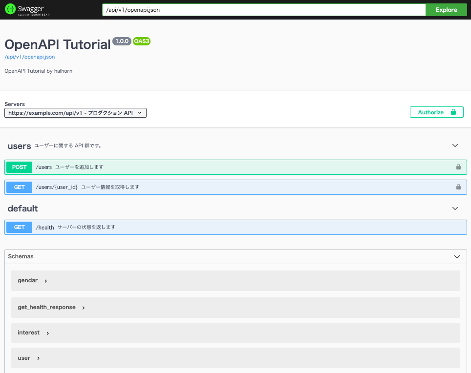

# OpenAPI Tutorial
OpenAPI 3.0 を使って python サーバーを作成するチュートリアルです。


# Install
```sh
git clone https://github.com/halhorn/openapi_tutorial.git
cd openapi_tutorial
pyenv install
pip install -U pip pipenv
pipenv install
```

# Run
```sh
pipenv run server
```
http://localhost:10080/api/v1/ui にアクセスすると Swagger-UI で API Specification が見れます。



## ユーザーと API-Key
サンプルのサーバーでは以下のユーザーと api_key, scope が設定されています。

- halhorn
    - api_key: abcd1234-1
    - scope: user:read, user:write
- nisehorn
    - api_key: abcd1234-2
    - scope: user:read
